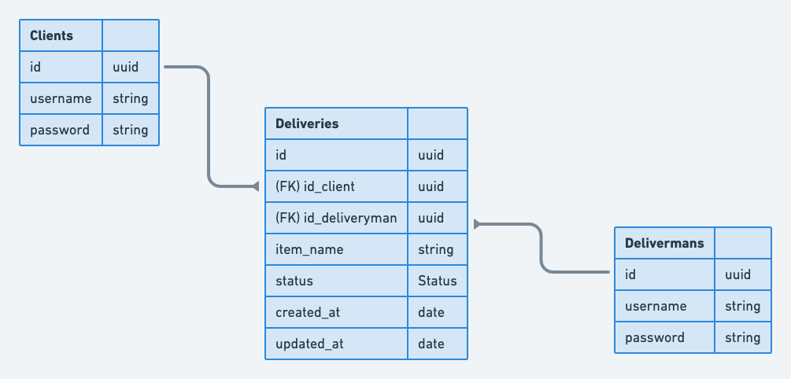

### speedy

[]()
[](https://github.com/wladimirgrf/certification/commits/master)
[](https://github.com/wladimirgrf/certification/issues)
[]()

Project developed for the Rocketseat Ignite (_Node.js Path_). This application is a simple REST API and It was built to manage package deliveries.

## 🌍 Ecosystem

Below the technologies, used to build this API:

|                      Name                                   |                         Status                          |
|:-----------------------------------------------------------:|:-------------------------------------------------------:|
| |  |
| | |
| |  |
| |  |
| |  |
| |  |

## 🧱 ERM



## ▶️ Getting started

**Requirements**

- [Node.js](https://nodejs.org/en/)
- [PostgreSQL Container](https://www.postgresql.org/)

**Clone the project**
```bash
$ git clone https://github.com/wladimirgrf/speedy.git && cd speedy
```

**Install the Project dependencies**
```bash
$ npm install
```

**Environment configuration**
```bash
# Make a copy of '.env.sample'
# Fill it with your environment variables
$ cp .env.sample .env
```

**Run the container**
```bash
# Create the instance of postgreSQL using docker
$ docker run --name postgres -e POSTGRES_PASSWORD={password} -p 5432:5432 -d postgres
```

**Migrations**
```bash
$ npx prisma migrate dev
```

**Launch the Application**
```bash
$ npm start
```

>The API will be launch at `localhost` on the chosen port or on the default `3333`<br>


## 🤝 Contributing

**Fork the repository and clone your fork**

```bash
$ git clone fork-url && cd speedy
```

**Create a branch for your edits**
```bash
$ git checkout -b new-feature
```

**Make the commit with your changes**
```bash
$ git commit -m 'feat: New feature'
```

**Send the code to your remote branch**
```bash
$ git push origin new-feature
```

Create a pull request with your version. <br>
After your pull request is merged, you can delete your branch.


## 📝 License

This project is licensed under the MIT License - see the [LICENSE](LICENSE) file for details.

